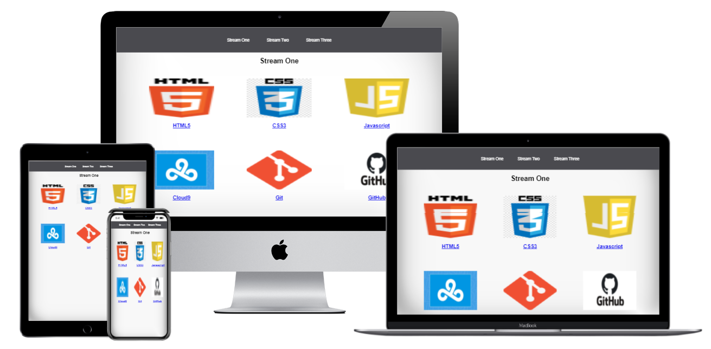

# My very first Webpage
***
## Code Institute mini project 
Welcome to my first Webpage that you can check out [here!](https://gillem.github.io/my-full-template/)

This site was a part of the learning material for Code Institute's Fullstack Web Developer program that I started with in July 2020. 
This is the first website I have ever built  in my life and I'm pretty satisfied with the knowledge of **Github** and **Gitpod** editor 
I gained through the first (out of four) part of this course.

## Project Description
***
This site was created in order to get familiar with common development tools like Cloud9, 
Git & GitHub, and how to use them to write and manage code. The project itself will display 
a breakdown of the different technologies used in each of the different sections of the program.

## Technology
***

Thos project was written in:
- **HTML5**
- **CSS3** 

and is currently hosted on GitHub pages.

In May 2021.g. the mockup image was uploaded to README.md file.